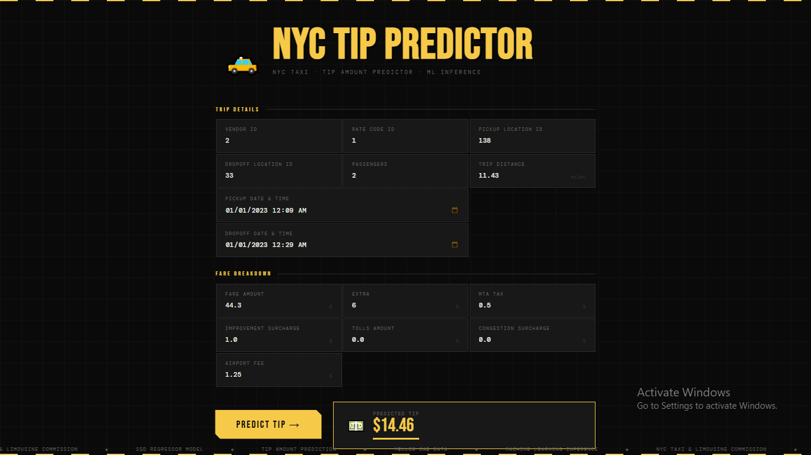

# NYC Taxi Tip Amount Prediction: End to End Data ML Pipeline

## 🚨 Problem Statement

For ride-share and taxi drivers, the base fare covers the operational costs of the vehicle, but the **tip amount dictates their actual profit**. However, tipping behavior is highly volatile and unpredictable. Currently, drivers rely on intuition or simply chase high-volume areas, which often results in wasted fuel and time waiting for rides that yield poor tips. 

This lack of actionable foresight creates specific pain points for two main groups:
- **For Drivers (Inefficiency):** Drivers cannot easily identify which specific zones, times, or effective routes will yield the highest return on their time. They need data to know where to wait.
- **For Customers (Static Tipping):** Customers are often prompted with rigid, static tip suggestions (e.g., 20%, 25%, 30%). Predicting an expected tip amount provides a dynamic, context-aware baseline that can help customers decide on a fair tip based on historical norms for that specific route and time.

**The Solution:** This project introduces a predictive machine learning pipeline that shifts strategy from a reactive "guessing game" to a proactive, data-driven approach. By forecasting the exact tip amount based on spatial (pickup/drop-off zones) and temporal (time, day, rush hour) factors, this system empowers drivers to strategically position themselves in high-yield scenarios while offering transparent tip estimates for riders.
---
## 🧠 Overview

The **NYC Taxi Tip Predictor** is an end-to-end machine learning pipeline that predicts passenger tip amounts using historical NYC TLC data. Built to transition ride-share drivers from guesswork to a data-driven strategy, this system predicts high-yield zones and times to help drivers maximize their hourly earnings.
---

## **Screenshot of UI**


---
## 🚀 Objectives

This portfolio piece was built to demonstrate a complete, end-to-end Machine Learning lifecycle, specifically focusing on:
- **Business Value:** Enables drivers and fleet managers to optimize routes and shift schedules based on predicted ROI rather than just ride volume, while also helping customers determine a fair tip amount based on historical data.
- **Advanced Feature Extraction:** Extract meaningful insights from large volumes of data.  
- **End to End MLOps:** Automates the complete ML lifecycle—from raw data ingestion and feature engineering to model training and evaluation.
- **Production-Ready:** Features a fully containerized deployment, ensuring the model is scalable, reproducible, and easily updated.
- **Experiment Tracking:** Logging model hyperparameters, artifacts, and metrics (achieving a **$1.22 MAE**) using **MLflow** and **DagsHub**.
- **Real-Time Inference Serving:** Wrapping the trained model in a fully functional, styled **Flask** web application that instantly translates user input into actionable financial predictions.

---
## ⚙️ Tech Stack

* **Language:** Python 3.11  
* **Machine Learning:** Scikit-Learn, Pandas, NumPy, Category Encoders
* **MLOps & Orchestration:** DVC (Data Version Control), MLflow, DagsHub
* **Web UI:** Flask, HTML5, Bootstrap 5
* **Deployment (Planned):** Docker, AWS (EC2/S3), GitHub Actions (CI/CD)
---
## 🔄 Development Workflow

This project strictly adheres to a modular design pattern. To experiment with the pipeline or add new features, follow this standard sequence:

1. Update `config.yaml` (paths/directories) and `params.yaml` (model hyperparameters).
2. Define data structures in the `entity` module.
3. Update the `ConfigurationManager` within `src/config`.
4. Modify the relevant pipeline `components` (e.g., ingestion, transformation, training).
5. Integrate the updated components into the specific `pipeline` script.
6. Register the pipeline in `main.py` and update `dvc.yaml` to track the new execution graph.
7. Serve the updated model via the `app.py` Flask interface.
---

## 🏗️ System Architecture

This project is built using a modular, component-based architecture orchestrated by **DVC (Data Version Control)**. 
1. **Data Ingestion:** Automatically fetches and extracts the NYC Taxi dataset.
2. **Data Validation:** Enforces schema rules and generates a validation status. Acts as a "Circuit Breaker" to halt the pipeline if anomalous data is detected.
3. **Data Transformation:** Handles complex feature engineering:
   - Datetime extraction (weekend flags, AM/PM, trip duration).
   - Cyclical encoding for pickup hours using sine/cosine transformations.
   - Spatial feature engineering (airport zone mapping).
   - Target Encoding and Standard Scaling (saved as `preprocessor.pkl` to prevent data leakage during inference).
4. **Model Training:** Trains an SGD Regressor, logging hyperparameters (alpha, penalty) to **MLflow** via DagsHub.
5. **Model Evaluation:** Calculates regression metrics (RMSE, MAE, R2) and saves them to `evaluation.json`.
6. **Inference Pipeline:** A dedicated prediction engine wrapped in a **Flask** web application for real-time user predictions.


## 💻 Local Installation & Execution
Follow these steps to run the end-to-end pipeline and start the web application on your local machine.

1. Clone the repository:
```bash
git clone https://github.com/mann-lean/data-science-project.git
cd data-science-project
```

2. Create and activate a **virtual environment**
```bash
conda create -p venv python=3.11.13 -y
conda activate venv  
```

3. Install dependencies
```bash
pip install -r requirements.txt
```

4. DagsHub setup: Create **Dagshub** account & setup for venv
```bash
$env:MLFLOW_TRACKING_URI = "URL"

$env:MLFLOW_TRACKING_USERNAME = "username"

$env:MLFLOW_TRACKING_PASSWORD = "password"
```
*(Note: Use `export` instead of `$env:` if you are on Linux/macOS).*

5. Initialize & Execute the DVC Pipeline: Because this project is orchestrated with Data Version Control (DVC), you do not need to run individual python scripts manually.
```bash
dvc init --subdir #(It will Initialize DVC directory , one level up for DVC Initialization)
dvc repro #(It will run dvc.yaml file & create dvc.lock file ,which file stores or tracks every data version stored in it)
```
Directed Acyclic Graph **(DAG)** For showing Graphical structure ,dependency pipeline on cmd
```bash
dvc dag
```
* `data_ingestion` is the root.
* `data_validation` depends on ingestion.
* `data_transformation` depends on both ingestion and validation (acting as a circuit breaker).
* `model_training` depends on transformation.
* `model_evaluation` depends on both transformation (for test data) and training (for the model).

*(Note: Ensure `dvc.lock`, `dvc.yaml`, and `.dvcignore` are committed to your Git repository to guarantee reproducibility for collaborators. Do not commit your heavy data artifacts).*

6. Launch the Web Interface
Start the Flask server to interact with the trained model:
```bash
python app.py
```
Navigate to `http://127.0.0.1:5000` in your web browser to access the UI and generate predictions.

---
## 🔮 Future Scope
- **Exogenous Data Integration:** Currently, this project explains ~70% of the variance in the target variable using only NYC TLC data. Because human behavior is dynamic, the remaining 30% is likely influenced by external factors. Integrating datasets like historical weather (rain, snow) or event schedules could capture the situational context that heavily influences tipping and improve model performance.
- **Interactive Analytics Dashboard:** Expand the Flask web application to include a "Dataset Insights" page. This will feature interactive visualizations (using libraries like Plotly or Dash) to allow users to explore historical tipping trends, high-yield zones, and peak hours before making a prediction.
- **Automated Retraining & Drift Monitoring:** As tipping behavior changes over time (concept drift) or inflation alters base fares (data drift), the model will degrade. Future iterations will include an automated CI/CD pipeline that triggers model retraining whenever new monthly data is published by the NYC TLC.

---
## 👨‍💻 Author
**Mann**
- **GitHub:** [@mann-lean](https://github.com/mann-lean)
- **LinkedIn:** [Mann .](https://www.linkedin.com/in/mann-32718a1b9)
- **Email:** mannk7062@gmail.com

